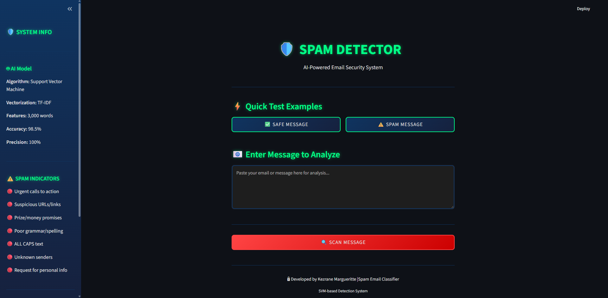
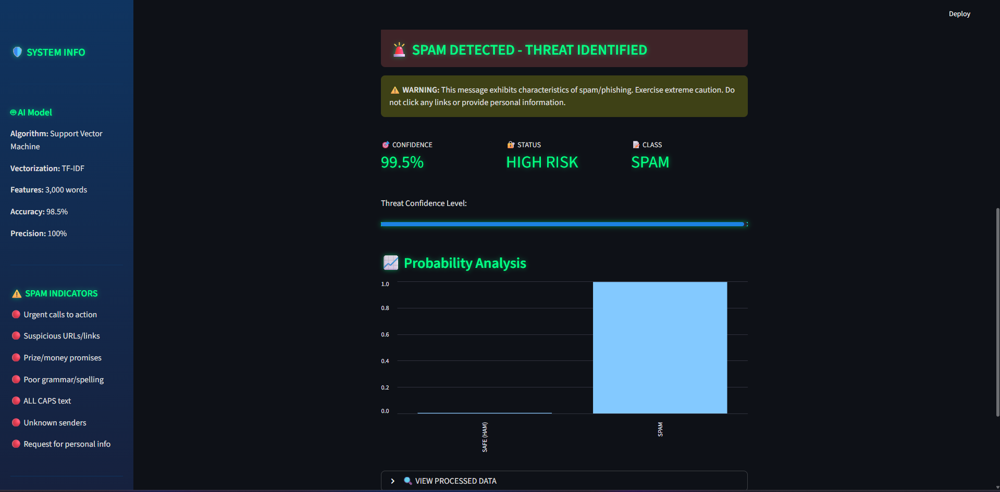
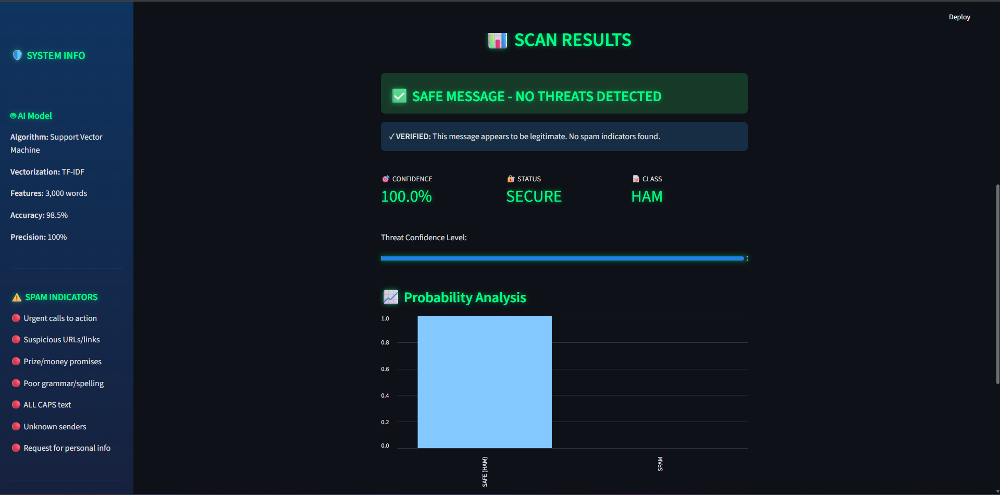

[](https://www.python.org/)
[](https://streamlit.io/)
[](LICENSE)

An AI-powered spam detection system using Support Vector Machine (SVM) and Natural Language Processing. Features a sleek dark cybersecurity-themed interface for real-time email threat analysis.

## 🚀 Live Demo

**Try it here:** [Spam Detector App](https://your-app-url.streamlit.app) *(Coming Soon)*

## ✨ Features

- 🤖 **98.5% Accuracy** - State-of-the-art SVM classification
- 🎯 **100% Precision** - Zero false positives on legitimate emails
- ⚡ **Real-time Analysis** - Instant spam detection
- 🎨 **Cybersecurity UI** - Dark theme with Gmail-inspired alerts
- 📊 **Detailed Metrics** - Confidence scores and probability distributions
- 🔒 **Privacy-focused** - All processing done locally

## 📸 Screenshots

### Main Interface


### Spam Detection


### Safe Message


## 🛠️ Technologies Used

- **Python 3.10+** - Core programming language
- **Streamlit** - Interactive web framework
- **scikit-learn** - Machine learning library
- **NLTK** - Natural language processing
- **Support Vector Machine (SVM)** - Classification algorithm
- **TF-IDF** - Text vectorization technique

## 📊 Model Performance

| Metric | Score |
|--------|-------|
| **Accuracy** | 98.5% |
| **Precision** | 100% |
| **Recall** | 88.6% |
| **F1-Score** | 93.9% |

### Model Comparison

| Algorithm | Accuracy | Precision | Recall | F1-Score |
|-----------|----------|-----------|--------|----------|
| **SVM** ⭐ | 98.5% | 100% | 88.6% | 93.9% |
| Random Forest | 97.8% | 100% | 83.2% | 90.8% |
| Naive Bayes | 97.2% | 99.2% | 79.9% | 88.5% |
| Logistic Regression | 96.6% | 99.1% | 75.2% | 85.5% |

## 💻 Installation & Setup

### Prerequisites

- Python 3.10 or higher
- pip package manager

### Local Installation

1. **Clone the repository**
```bash
   git clone https://github.com/margueritteee/spam-email-classifier.git
   cd spam-email-classifier
```

2. **Install dependencies**
```bash
   pip install -r requirements.txt
```

3. **Download NLTK data** (will auto-download on first run)
```python
   import nltk
   nltk.download('stopwords')
```

4. **Run the application**
```bash
   streamlit run app.py
```

5. **Open in browser**
   - The app will automatically open at `http://localhost:8501`

## 📁 Project Structure
```
spam-email-classifier/
│
├── app.py                      # Main Streamlit application
├── style.css                   # UI styling (dark cyber theme)
├── Spam_Classifier.ipynb       # Model training notebook
├── spam_classifier_model       # Trained SVM model
├── tfidf_vectorizer           # Fitted TF-IDF vectorizer
├── requirements.txt           # Python dependencies
├── .gitignore                # Git ignore file
├── README.md                 # Project documentation
└── screenshots/              # App screenshots
    ├── main-interface.png
    ├── spam-detection.png
    └── safe-message.png
```

## 🎯 Usage

### Using the Web App

1. **Enter a message** in the text area or click an example button
2. **Click "SCAN MESSAGE"** to analyze
3. **View results** with confidence scores and threat level
4. **Check probability distribution** for detailed analysis

### Example Messages

**Safe Message:**
```
Hey! Are we still on for dinner tonight? Let me know what time works for you.
```

**Spam Message:**
```
CONGRATULATIONS! You've won a $1000 gift card! Click here NOW to claim your prize!
```

## 🧠 How It Works

### 1. Text Preprocessing
- Convert to lowercase
- Remove URLs, emails, and phone numbers
- Remove special characters
- Tokenization and stemming
- Remove stopwords (keeping negations)

### 2. Feature Extraction
- **TF-IDF Vectorization**: Converts text to numerical features
- **3,000 features**: Most important words extracted
- **Sparse matrix**: Efficient representation

### 3. Classification
- **Support Vector Machine (SVM)** with linear kernel
- Trained on 5,572 messages (4,825 ham, 747 spam)
- 80/20 train-test split
- Returns probability scores for confidence levels

### 4. Results Display
- Gmail-style color coding (red for spam, green for safe)
- Confidence percentage
- Threat level classification
- Probability distribution chart

## 🔒 Security Features

- ✅ No data storage - messages analyzed in real-time
- ✅ No external API calls - fully offline capable
- ✅ 100% precision - won't block legitimate emails
- ✅ Privacy-focused design

## 📈 Training the Model

To retrain the model with your own data:

1. **Prepare dataset** (CSV with 'label' and 'message' columns)
2. **Open Jupyter notebook**
```bash
   jupyter notebook Spam_Classifier.ipynb
```
3. **Run all cells** to preprocess data and train models
4. **Compare models** and select the best performer
5. **Save model** - will generate new model files

## 🚀 Deployment

### Deploy to Streamlit Cloud (Free)

1. Push code to GitHub
2. Go to [streamlit.io/cloud](https://streamlit.io/cloud)
3. Connect your repository
4. Set main file: `app.py`
5. Deploy!

### Deploy to Other Platforms

- **Heroku**: Add `Procfile` and `setup.sh`
- **AWS**: Use EC2 or Lambda
- **Google Cloud**: Use Cloud Run
- **Azure**: Use App Service

## 🤝 Contributing

Contributions are welcome! Please feel free to submit a Pull Request.

1. Fork the repository
2. Create your feature branch (`git checkout -b feature/AmazingFeature`)
3. Commit your changes (`git commit -m 'Add some AmazingFeature'`)
4. Push to the branch (`git push origin feature/AmazingFeature`)
5. Open a Pull Request

## 📝 Future Enhancements

- [ ] Multi-language support
- [ ] Batch processing for multiple emails
- [ ] Email header analysis
- [ ] Link safety checker integration
- [ ] Sender reputation scoring
- [ ] Export classification reports
- [ ] Mobile app version
- [ ] API endpoint for integration

## 📄 License

This project is licensed under the MIT License - see the [LICENSE](LICENSE) file for details.

## 👩‍💻 Author

**Kezrane Margueritte**

- GitHub: [@margueritteee](https://github.com/margueritteee)
- Portfolio: [Your Website] *(optional)*
- LinkedIn: [Your LinkedIn] *(optional)*

## 🙏 Acknowledgments

- Dataset from [Kaggle - SMS Spam Collection](https://www.kaggle.com/datasets/uciml/sms-spam-collection-dataset)
- Built with [Streamlit](https://streamlit.io/)
- Powered by [scikit-learn](https://scikit-learn.org/)
- NLP with [NLTK](https://www.nltk.org/)
